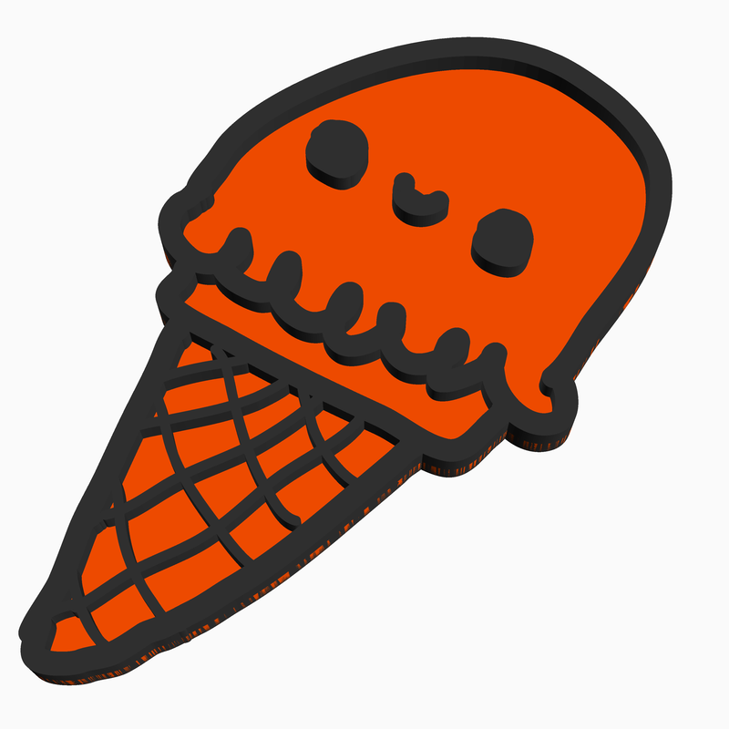
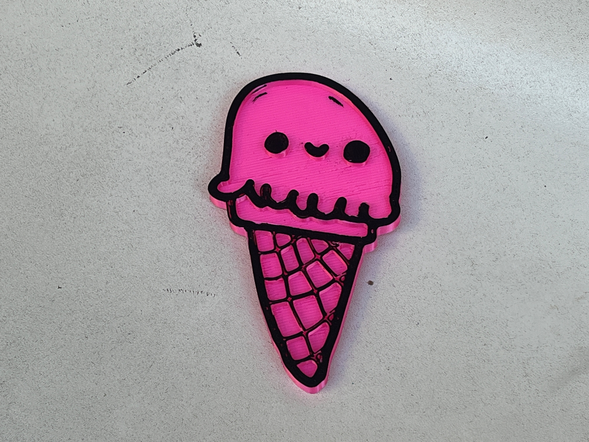
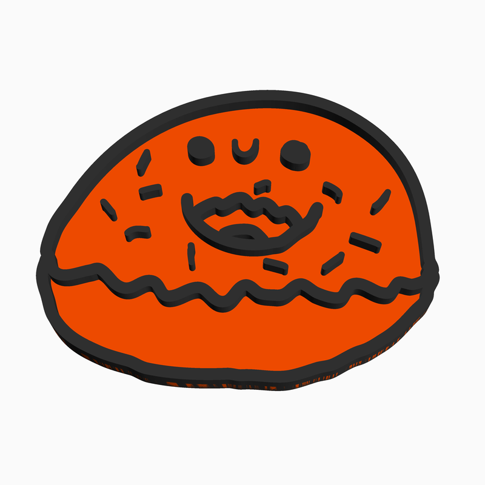
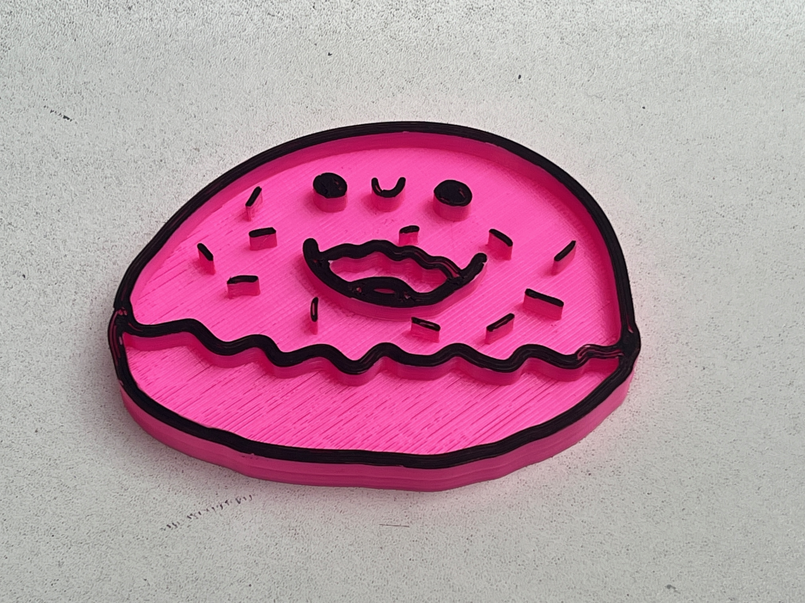

# 3D Kawaii Doodles

It's an easy print without supports. Either use a paint pen to draw on the top layer or set up a filament change at 5 mm.

Inspired by the Mini Kawaii Doodle Class book by Zainab Khan, I have been sketching cute doodles, making 3D models and then 3D-printing them out.

I use Affinity Designer to sketch on my iPad, export the art in SVG format and generate STLs using OpenSCAD.

## License

CC0

## Author

Leon Brocard <acme@astray.com>
